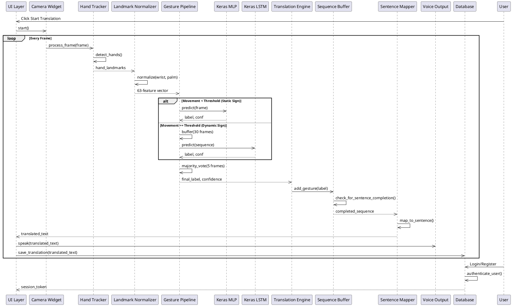

# EmoSign v3.0 - System Block Diagram
*Sign Language Translator - High-Level Architecture*

---

## System Block Diagram

```
┌─────────────────────────────────────────────────────────────────────────────┐
│                              PRESENTATION LAYER                             │
│  ┌─────────────┐  ┌─────────────┐  ┌─────────────┐  ┌─────────────┐        │
│  │ Main Window │  │ Live Trans. │  │ Video Trans.│  │  Learning   │        │
│  │   (PySide6) │  │    Page     │  │    Page     │  │    Pages    │        │
│  └──────┬──────┘  └──────┬──────┘  └──────┬──────┘  └──────┬──────┘        │
└─────────┼────────────────┼─────────────────┼───────────────┼───────────────┘
          │                │                 │               │
          ▼                ▼                 ▼               ▼
┌─────────────────────────────────────────────────────────────────────────────┐
│                              DETECTION LAYER                                │
│  ┌─────────────┐  ┌─────────────┐  ┌─────────────┐  ┌─────────────┐        │
│  │   Camera    │  │    Video    │  │    Hand     │  │  Feature    │        │
│  │   Handler   │◄─┤   Handler   │──┤   Tracker   │──┤  Extractor  │        │
│  └──────┬──────┘  └─────────────┘  └─────────────┘  └──────┬──────┘        │
│         │                (MediaPipe)                        │               │
└─────────┼───────────────────────────────────────────────────┼───────────────┘
          │                                                   │
          ▼                                                   ▼
┌─────────────────────────────────────────────────────────────────────────────┐
│                            BUSINESS LOGIC LAYER                             │
│  ┌───────────────────┐  ┌───────────────────┐  ┌─────────────┐  ┌─────────────┐
│  │  Gesture Pipeline │  │  Sequence Buffer  │  │  Sentence   │  │   Gesture   │
│  │ (MLP/LSTM/Heuristic)│──┤ (Majority Vote)   │──┤    Mapper   │──┤  Dictionary │
│  └─────────┬─────────┘  └───────────────────┘  └─────────────┘  └─────────────┘
│            │                                                                   │
│  ┌─────────┴─────────┐                                                       │
│  │  Translation Engine │                                                       │
│  └─────────┬─────────┘                                                       │
└─────────────┼─────────────────────────────────────────────────────────────────┘
              │
              ▼
┌─────────────────────────────────────────────────────────────────────────────┐
│                               DATA LAYER                                    │
│  ┌─────────────┐  ┌─────────────┐  ┌─────────────┐                         │
│  │   SQLite    │  │  ML Models  │  │   Assets    │                         │
│  │  Database   │  │  (.keras)   │  │   (Media)   │                         │
│  └─────────────┘  └─────────────┘  └─────────────┘                         │
└─────────────────────────────────────────────────────────────────────────────┘
```

---

## Component Details

### Presentation Layer (UI)
| Component | Technology | Purpose |
|-----------|------------|---------|
| Main Window | PySide6 | Application shell & navigation |
| Live Translation | PySide6 | Real-time camera translation |
| Video Translation | PySide6 | Video file processing |
| Learning Pages | PySide6 | Tutorials & sign library |

### Detection Layer
| Component | Technology | Purpose |
|-----------|------------|---------|
| Camera Handler | OpenCV | Webcam frame capture |
| Video Handler | OpenCV | Video file processing |
| Hand Tracker | MediaPipe | Hand landmark detection |
| Feature Extractor | NumPy | Extract 63D feature vectors |

### Business Logic Layer
| Component | Technology | Purpose |
|-----------|------------|---------|
| Gesture Pipeline | Python/Keras | Orchestrates ML/heuristic classification |
| Sequence Buffer | Python | Majority-vote smoothing (5 frames) |
| Sentence Mapper | Python | Map gestures to sentences |
| Translation Engine | Python | Coordinate translation pipeline |

### Data Layer
| Component | Technology | Purpose |
|-----------|------------|---------|
| SQLite Database | SQLite3 | User data & translation history |
| ML Models | Keras | Trained classifier models (.keras) |
| Assets | Various | Images, sounds, media files |

---

## Data Flow Summary



---

## Key Technologies

- **GUI Framework**: PySide6 (Qt for Python)
- **Computer Vision**: OpenCV, MediaPipe
- **Machine Learning**: TensorFlow 2.x, Keras
- **Database**: SQLite3
- **Text-to-Speech**: pyttsx3

---

*Generated for EmoSign v3.0 - Sign Language Translator*
