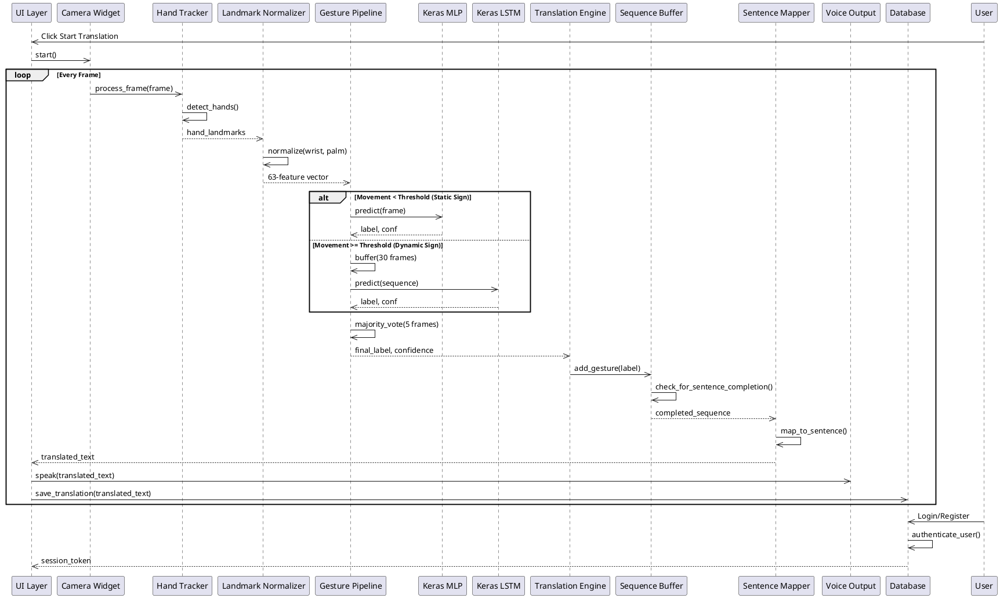

# EmoSign v3.0 - System Block Diagram
*Sign Language Translator - High-Level Architecture*

---

## System Block Diagram

```
┌─────────────────────────────────────────────────────────────────────────────┐
│                              PRESENTATION LAYER                             │
│  ┌─────────────┐  ┌─────────────┐  ┌─────────────┐  ┌─────────────┐        │
│  │ Main Window │  │ Live Trans. │  │ Video Trans.│  │  Learning   │        │
│  │   (PySide6) │  │    Page     │  │    Page     │  │    Pages    │        │
│  └──────┬──────┘  └──────┬──────┘  └──────┬──────┘  └──────┬──────┘        │
└─────────┼────────────────┼─────────────────┼───────────────┼───────────────┘
          │                │                 │               │
          ▼                ▼                 ▼               ▼
┌─────────────────────────────────────────────────────────────────────────────┐
│                              DETECTION LAYER                                │
│  ┌─────────────┐  ┌─────────────┐  ┌─────────────┐  ┌─────────────┐        │
│  │   Camera    │  │    Video    │  │    Hand     │  │  Feature    │        │
│  │   Handler   │◄─┤   Handler   │──┤   Tracker   │──┤  Extractor  │        │
│  └──────┬──────┘  └─────────────┘  └─────────────┘  └──────┬──────┘        │
│         │                (MediaPipe)                        │               │
└─────────┼───────────────────────────────────────────────────┼───────────────┘
          │                                                   │
          ▼                                                   ▼
┌─────────────────────────────────────────────────────────────────────────────┐
│                            BUSINESS LOGIC LAYER                             │
│  ┌───────────────────┐  ┌───────────────────┐  ┌─────────────┐  ┌─────────────┐
│  │  Gesture Pipeline │  │  Sequence Buffer  │  │  Sentence   │  │   Gesture   │
│  │ (MLP/LSTM/Heuristic)│──┤ (Majority Vote)   │──┤    Mapper   │──┤  Dictionary │
│  └─────────┬─────────┘  └───────────────────┘  └─────────────┘  └─────────────┘
│            │                                                                   │
│  ┌─────────┴─────────┐                                                       │
│  │  Translation Engine │                                                       │
│  └─────────┬─────────┘                                                       │
└─────────────┼─────────────────────────────────────────────────────────────────┘
              │
              ▼
┌─────────────────────────────────────────────────────────────────────────────┐
│                               DATA LAYER                                    │
│  ┌─────────────┐  ┌─────────────┐  ┌─────────────┐                         │
│  │   SQLite    │  │  ML Models  │  │   Assets    │                         │
│  │  Database   │  │  (.keras)   │  │   (Media)   │                         │
│  └─────────────┘  └─────────────┘  └─────────────┘                         │
└─────────────────────────────────────────────────────────────────────────────┘
```

---

## Component Details

### Presentation Layer (UI)
| Component | Technology | Purpose |
|-----------|------------|---------|
| Main Window | PySide6 | Application shell & navigation |
| Live Translation | PySide6 | Real-time camera translation |
| Video Translation | PySide6 | Video file processing |
| Learning Pages | PySide6 | Tutorials & sign library |

### Detection Layer
| Component | Technology | Purpose |
|-----------|------------|---------|
| Camera Handler | OpenCV | Webcam frame capture |
| Video Handler | OpenCV | Video file processing |
| Hand Tracker | MediaPipe | Hand landmark detection |
| Feature Extractor | NumPy | Extract 63D feature vectors |

### Business Logic Layer
| Component | Technology | Purpose |
|-----------|------------|---------|
| Gesture Pipeline | Python/Keras | Orchestrates ML/heuristic classification |
| Sequence Buffer | Python | Majority-vote smoothing (5 frames) |
| Sentence Mapper | Python | Map gestures to sentences |
| Translation Engine | Python | Coordinate translation pipeline |

### Data Layer
| Component | Technology | Purpose |
|-----------|------------|---------|
| SQLite Database | SQLite3 | User data & translation history |
| ML Models | Keras | Trained classifier models (.keras) |
| Assets | Various | Images, sounds, media files |

---

## Data Flow Summary



---

## Key Technologies

- **GUI Framework**: PySide6 (Qt for Python)
- **Computer Vision**: OpenCV, MediaPipe
- **Machine Learning**: TensorFlow 2.x, Keras
- **Database**: SQLite3
- **Text-to-Speech**: pyttsx3

---

## Release Notes

### v3.5 — Bug Fix Pass (February 2026)

| # | File | Category | Fix |
|---|------|----------|-----|
| 1 | `core/analytics.py` | Crash | `_load_stats` filtered unknown JSON fields to prevent `TypeError` on schema changes |
| 2 | `core/analytics.py` | Logic | `night_owl` (0–4 AM) and `early_bird` (4–6 AM) hour windows no longer overlap |
| 3 | `ui/pages/history_page.py` | UI | `empty_state` widget was permanently removed from layout after first load; fixed with `removeWidget` + `indexOf` |
| 4 | `ui/pages/history_page.py` | UI | `_show_empty_state(message)` silently ignored its argument; now updates description label |
| 5 | `ui/pages/history_page.py` | Performance | Moved 3× inline `import asyncio` to module-level |
| 6 | `ui/pages/dashboard_page.py` | UI | Greeting showed raw email address; now extracts clean display name |
| 7 | `ml/gesture_pipeline.py` | Performance | `DEBUG_MOVEMENT = True` was spamming console every 10 frames; set to `False` |
| 8 | `ml/gesture_pipeline.py` | Logic | `_on_hand_lost()` discarded LSTM's final prediction when hand left frame; now uses it |
| 9 | `ml/gesture_pipeline.py` | Logic | Stale landmark frames leaked into next gesture's LSTM buffer; added `clear()` on motion stop |
| 10 | `detector/dynamic_gestures.py` | Accuracy | J/Z used palm-center trajectory; now uses index fingertip (`landmark[8]`) via new `fingertip_buffer` |
| 11 | `detector/dynamic_gestures.py` | Logic | 60-frame timeout was framerate-dependent; now uses `self.buffer_size` |
| 12 | `core/simple_engine.py` | Feature | Added `undo_last()` method to support Delete/backspace in translation UI |
| 13 | `ui/pages/live_translation_page.py` | Bug | Space and Delete buttons were `pass` no-ops; fully implemented with `_committed_text` state |
| 14 | `ui/pages/live_translation_page.py` | Bug | `pipeline.stop()` missing from `_stop_and_translate`; camera kept running after Stop & Translate |
| 15 | `ui/pages/live_translation_page.py` | Cleanup | Removed dead `_ml_handled_frame` attribute never read anywhere |
| 16 | `ui/pages/conversation_page.py` | Memory | Sign panel animation created new `QTimer()` per letter; fixed to reuse single instance |
| 17 | `ui/camera_widget.py` | Performance | `from collections import Counter` was re-imported inside hot `_update_frame` path; moved to module-level |
| 18 | `ui/camera_widget.py` | Visual | Trajectory overlay used palm-center path for J/Z; now uses `fingertip_buffer` to match detection |
| 19 | `ui/pages/game_page.py` | Bug | `nn_gesture_detected` signal never connected; game only used legacy PyTorch path. Added `_on_nn_gesture` handler |
| 20 | `ui/pages/training_page.py` | Cleanup | Dead `_capture_timer` firing `_capture_sample: pass` every 100ms removed; `_on_features` handles collection |

---

*Generated for EmoSign v3.5 — Sign Language Translator*
