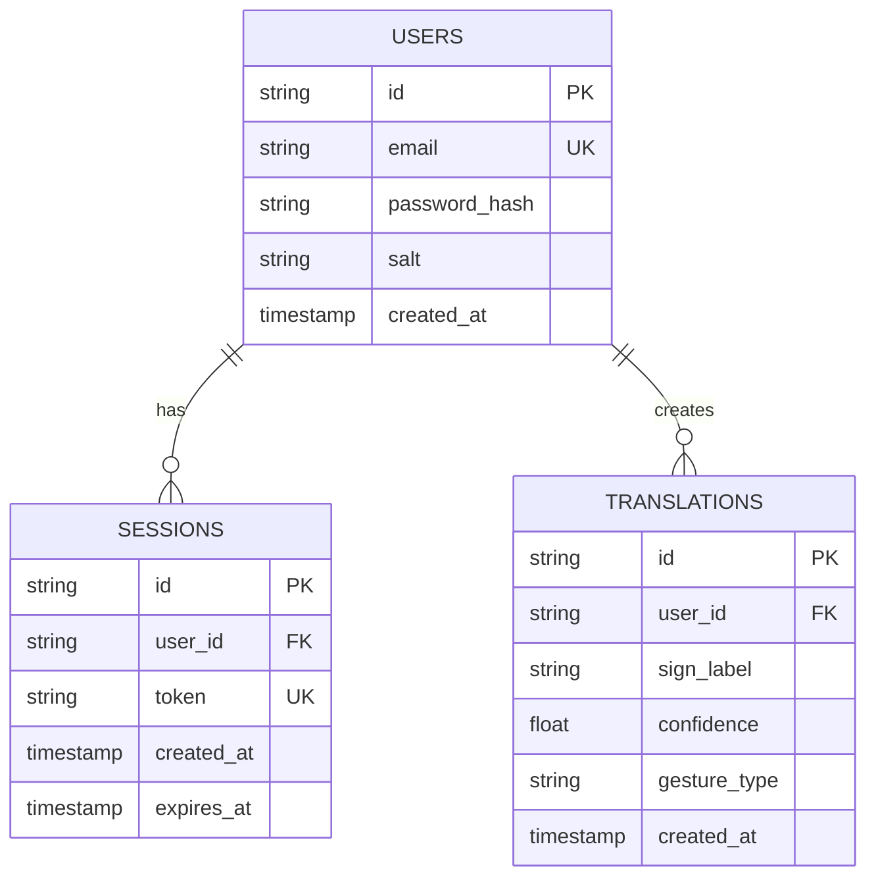
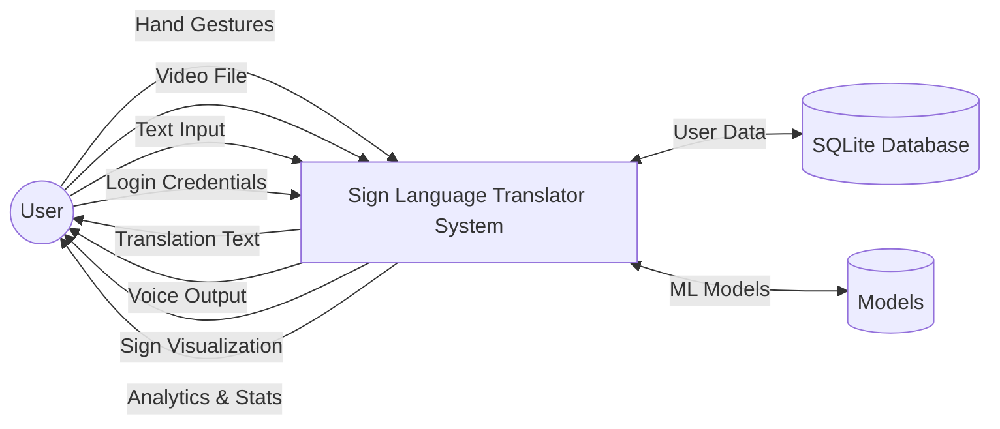
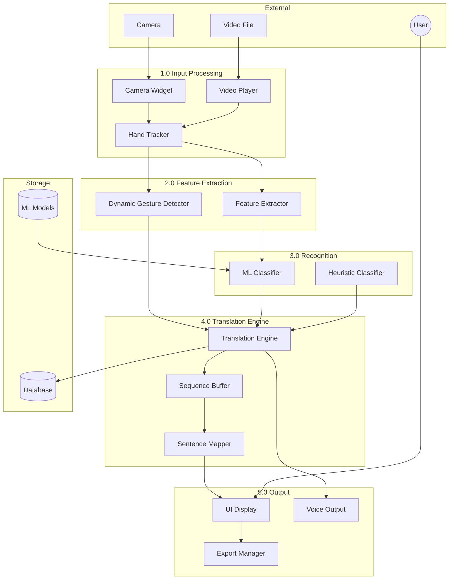
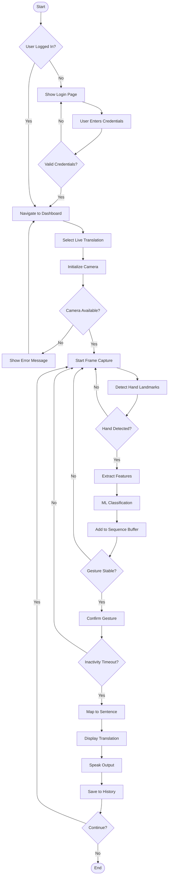
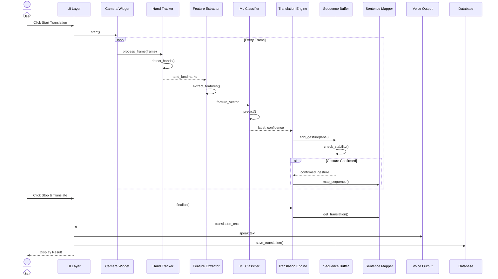
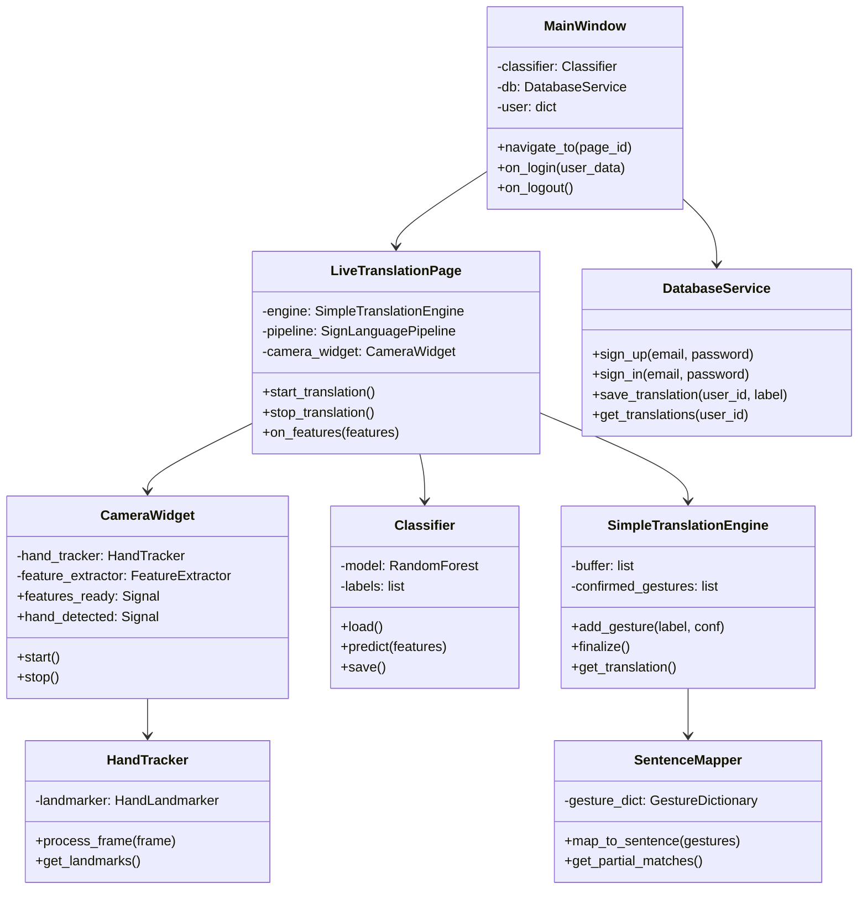
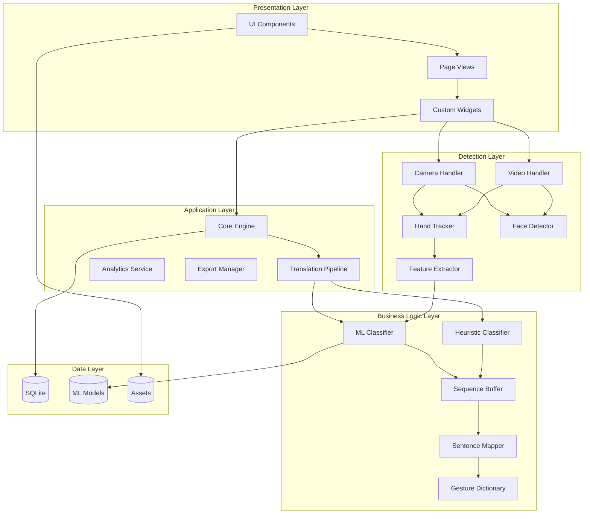
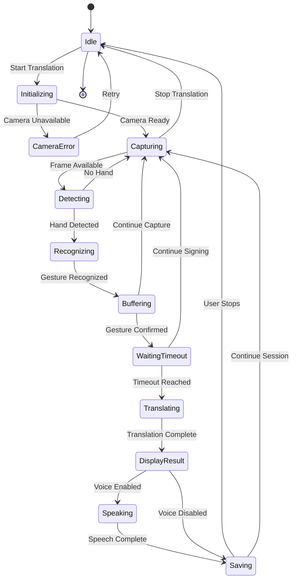
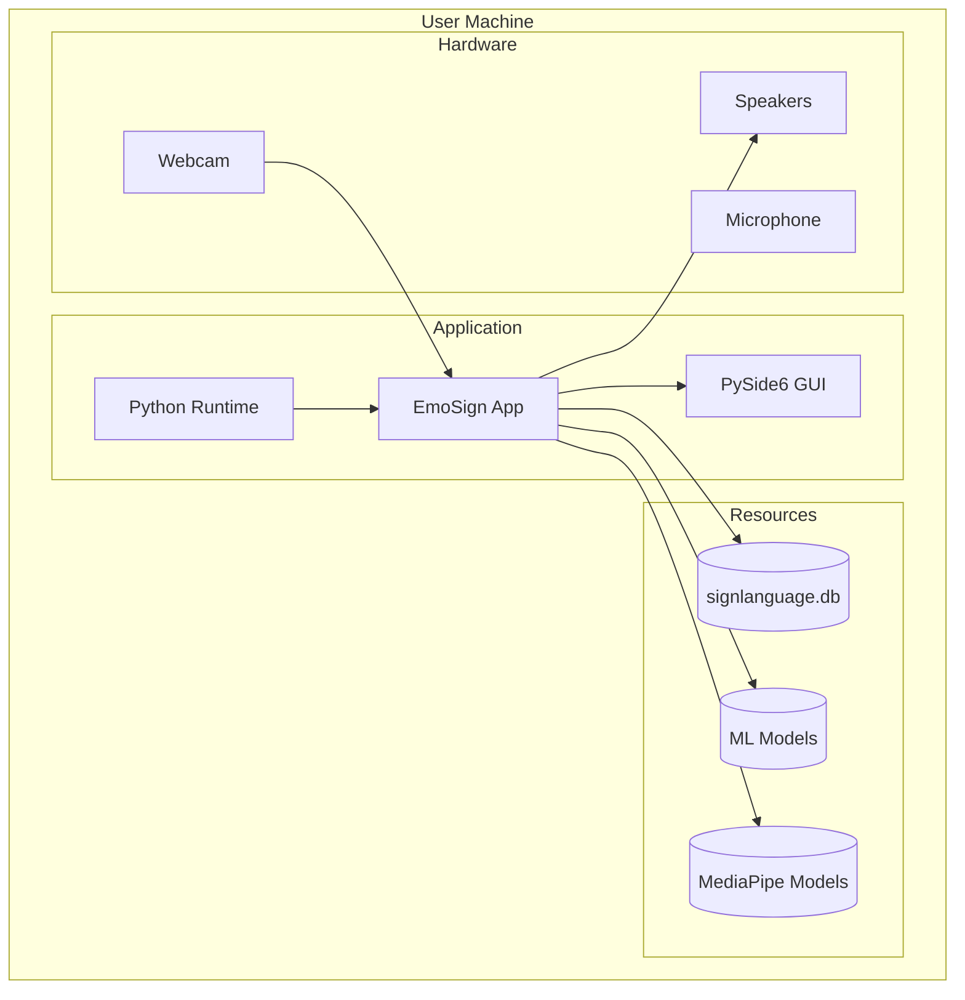

# EmoSign v3.0 - System Diagrams
*Sign Language Translator - Technical Documentation*

---

## 1. Entity Relationship (ER) Diagram

---

## 2. Use Case Diagram

```mermaid
flowchart TB
    subgraph Actors
        U((User))
        A((Admin))
        G((Guest))
    end
    
    subgraph "Authentication"
        UC1[Sign Up]
        UC2[Login]
        UC3[Logout]
        UC4[Change Password]
    end
    
    subgraph "Core Translation"
        UC5[Live Camera Translation]
        UC6[Video File Translation]
        UC7[Text to Sign]
        UC8[View Translation History]
        UC9[Export Translation]
    end
    
    subgraph "Learning"
        UC10[View Tutorials]
        UC11[Browse Sign Library]
        UC12[Train Custom Gestures]
    end
    
    subgraph "Settings & Analytics"
        UC13[View Analytics]
        UC14[Configure Settings]
        UC15[Toggle Theme]
    end
    
    subgraph "Admin Functions"
        UC16[Manage Users]
        UC17[View System Stats]
    end
    
    U --> UC1 & UC2 & UC3 & UC4
    U --> UC5 & UC6 & UC7 & UC8 & UC9
    U --> UC10 & UC11 & UC12
    U --> UC13 & UC14 & UC15
    
    G --> UC5 & UC6 & UC10 & UC11
    
    A --> UC16 & UC17
    A --> UC2 & UC3
```

---

## 3. Data Flow Diagram (DFD) - Level 0

---

## 4. Data Flow Diagram (DFD) - Level 1

---

## 5. Activity Diagram - Live Translation Flow

---

## 6. Sequence Diagram - Translation Process

---

## 7. Class Diagram - Core Components

---

## 8. Component Diagram

---

## 9. State Diagram - Translation States

---

## 10. Deployment Diagram

---

## Legend

| Diagram Type | Purpose |
|--------------|---------|
| ER Diagram | Database structure and relationships |
| Use Case | User interactions with system |
| DFD Level 0 | High-level data flow overview |
| DFD Level 1 | Detailed process data flow |
| Activity | Translation workflow steps |
| Sequence | Object interactions over time |
| Class | Object-oriented structure |
| Component | System architecture layers |
| State | Translation state machine |
| Deployment | Physical deployment structure |

---

*Generated for EmoSign v3.0 - Sign Language Translator*
